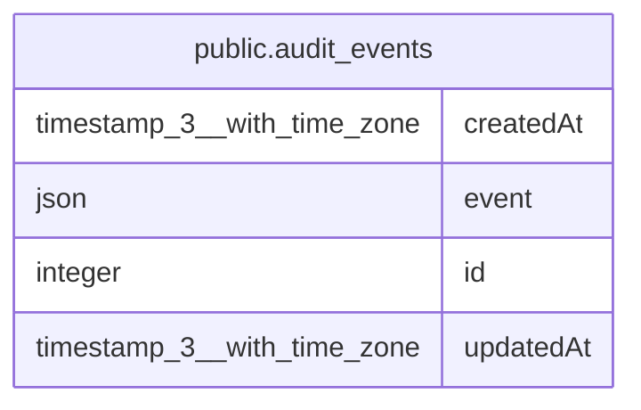

# public.audit_events

## Columns

| Name | Type | Default | Nullable | Children | Parents | Comment |
| ---- | ---- | ------- | -------- | -------- | ------- | ------- |
| createdAt | timestamp(3) with time zone | CURRENT_TIMESTAMP(3) | false |  |  |  |
| event | json | '{}'::json | false |  |  | The event that was emitted. |
| id | integer |  | false |  |  |  |
| updatedAt | timestamp(3) with time zone | CURRENT_TIMESTAMP(3) | false |  |  |  |

## Constraints

| Name | Type | Definition |
| ---- | ---- | ---------- |
| PK_910f64d901a5c3e9878f0d4a407 | PRIMARY KEY | PRIMARY KEY (id) |
| audit_events_createdAt_not_null | n | NOT NULL "createdAt" |
| audit_events_event_not_null | n | NOT NULL event |
| audit_events_id_not_null | n | NOT NULL id |
| audit_events_updatedAt_not_null | n | NOT NULL "updatedAt" |

## Indexes

| Name | Definition |
| ---- | ---------- |
| PK_910f64d901a5c3e9878f0d4a407 | CREATE UNIQUE INDEX "PK_910f64d901a5c3e9878f0d4a407" ON public.audit_events USING btree (id) |

## Relations

---

> Generated by [tbls](https://github.com/k1LoW/tbls)
