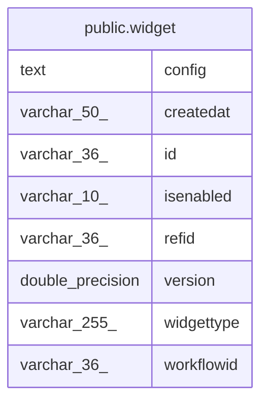

# public.widget

## Columns

| Name | Type | Default | Nullable | Children | Parents | Comment |
| ---- | ---- | ------- | -------- | -------- | ------- | ------- |
| config | text |  | true |  |  |  |
| createdat | varchar(50) |  | true |  |  |  |
| id | varchar(36) |  | false |  |  |  |
| isenabled | varchar(10) |  | true |  |  |  |
| refid | varchar(36) |  | true |  |  |  |
| version | double precision |  | true |  |  |  |
| widgettype | varchar(255) |  | true |  |  |  |
| workflowid | varchar(36) |  | true |  |  |  |

## Constraints

| Name | Type | Definition |
| ---- | ---- | ---------- |
| widget_id_not_null | n | NOT NULL id |
| widget_pkey | PRIMARY KEY | PRIMARY KEY (id) |

## Indexes

| Name | Definition |
| ---- | ---------- |
| widget_pkey | CREATE UNIQUE INDEX widget_pkey ON public.widget USING btree (id) |

## Relations

---

> Generated by [tbls](https://github.com/k1LoW/tbls)
