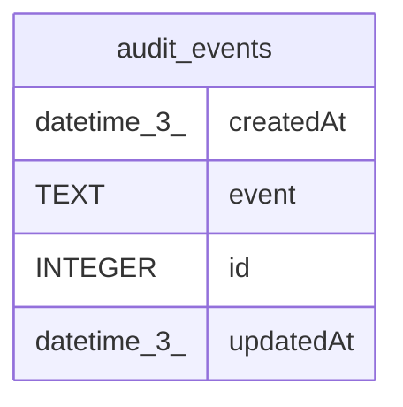

# audit_events

## Description

<details>
<summary><strong>Table Definition</strong></summary>

```sql
CREATE TABLE "audit_events" ("id" integer PRIMARY KEY NOT NULL, "event" text NOT NULL DEFAULT ('{}'), "createdAt" datetime(3) NOT NULL DEFAULT (STRFTIME('%Y-%m-%d %H:%M:%f', 'NOW')), "updatedAt" datetime(3) NOT NULL DEFAULT (STRFTIME('%Y-%m-%d %H:%M:%f', 'NOW')))
```

</details>

## Columns

| Name | Type | Default | Nullable | Children | Parents | Comment |
| ---- | ---- | ------- | -------- | -------- | ------- | ------- |
| createdAt | datetime(3) | STRFTIME('%Y-%m-%d %H:%M:%f', 'NOW') | false |  |  |  |
| event | TEXT | '{}' | false |  |  |  |
| id | INTEGER |  | false |  |  |  |
| updatedAt | datetime(3) | STRFTIME('%Y-%m-%d %H:%M:%f', 'NOW') | false |  |  |  |

## Constraints

| Name | Type | Definition |
| ---- | ---- | ---------- |
| id | PRIMARY KEY | PRIMARY KEY (id) |

## Relations



---

> Generated by [tbls](https://github.com/k1LoW/tbls)
