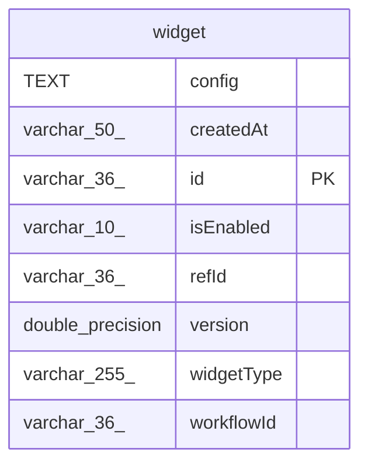

# widget

## Description

<details>
<summary><strong>Table Definition</strong></summary>

```sql
CREATE TABLE widget (
				id varchar(36) PRIMARY KEY,
				workflowId varchar(36),
				widgetType varchar(255),
				refId varchar(36),
				isEnabled varchar(10),
				version double precision,
				createdAt varchar(50),
				config text
			)
```

</details>

## Columns

| Name | Type | Default | Nullable | Children | Parents | Comment |
| ---- | ---- | ------- | -------- | -------- | ------- | ------- |
| config | TEXT |  | true |  |  |  |
| createdAt | varchar(50) |  | true |  |  |  |
| id | varchar(36) |  | true |  |  |  |
| isEnabled | varchar(10) |  | true |  |  |  |
| refId | varchar(36) |  | true |  |  |  |
| version | double precision |  | true |  |  |  |
| widgetType | varchar(255) |  | true |  |  |  |
| workflowId | varchar(36) |  | true |  |  |  |

## Constraints

| Name | Type | Definition |
| ---- | ---- | ---------- |
| id | PRIMARY KEY | PRIMARY KEY (id) |
| sqlite_autoindex_widget_1 | PRIMARY KEY | PRIMARY KEY (id) |

## Indexes

| Name | Definition |
| ---- | ---------- |
| sqlite_autoindex_widget_1 | PRIMARY KEY (id) |

## Relations



---

> Generated by [tbls](https://github.com/k1LoW/tbls)
